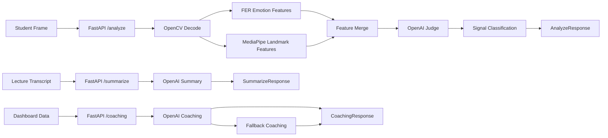
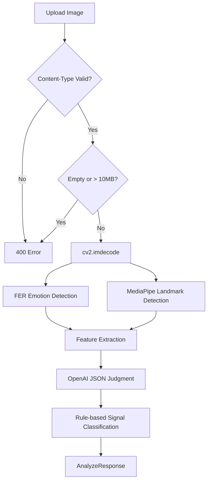
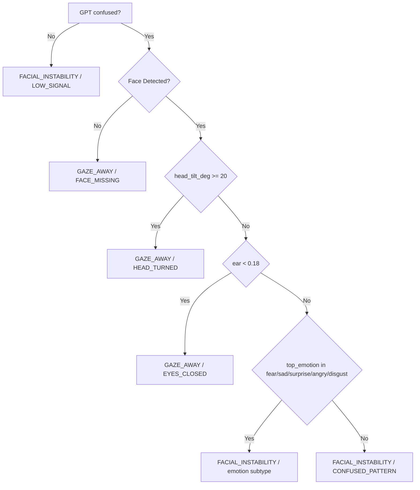
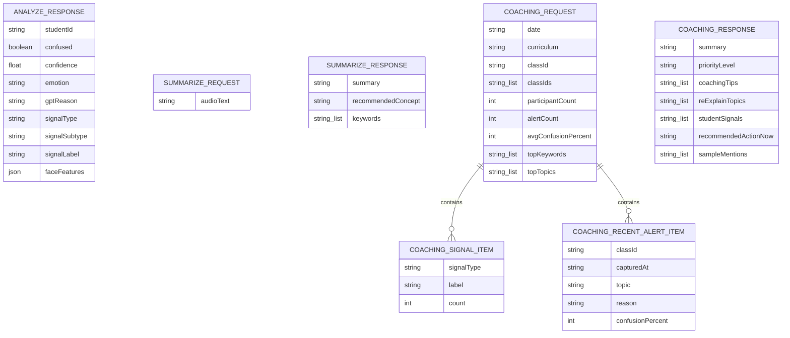

# Confusion Detection FastAPI

교육생 얼굴 프레임과 수업 텍스트를 바탕으로 이해 저하 신호를 분석하고, 요약과 코칭 가이드를 생성하는 FastAPI 서비스입니다.  
현재 구현은 `FER + MediaPipe + OpenAI` 조합을 사용하며, 분석 API는 얼굴 표정 특징과 GPT 판단을 함께 사용합니다.

## 핵심 변경 반영 사항

README 마지막 수정 커밋 `✨Feature: README.md 수정`(`2026-04-13 13:51:00 +0900`) 이후 반영된 주요 변경은 아래와 같습니다.

- `analyze` 응답의 `confidence` 의미가 FER 감정 confidence에서 "교육생이 현재 내용을 이해하지 못한 정도(0~1)"로 변경되었습니다.
- `summarize` 응답의 `keywords` 최대 개수가 3개에서 5개로 확장되었습니다.
- GPT 분석 실패 시 분석 사유 메시지가 `"AI 분석 실패"`로 정리되었습니다.

## 한눈에 보기

| 항목 | 내용 |
| --- | --- |
| 런타임 | Python 3.11 |
| 프레임워크 | FastAPI 0.111.0, Uvicorn 0.29.0 |
| API Prefix | `/ai-api` |
| 주요 기능 | 얼굴 프레임 분석, 강의 텍스트 요약, 대시보드 기반 AI 코칭 |
| 얼굴 감정 분석 | `fer==22.5.1` |
| 얼굴 랜드마크 | `mediapipe==0.10.33` |
| LLM | OpenAI Chat Completions |
| 기본 모델 | `gpt-5.4-mini` |
| 기본 포트 | `8000` |

## 아키텍처



## 분석 흐름



## 신호 분류 규칙



감정별 `signalSubtype` 매핑은 다음과 같습니다.

| top_emotion | signal_subtype |
| --- | --- |
| `fear` | `FEAR_DOMINANT` |
| `sad` | `SAD_DOMINANT` |
| `surprise` | `SURPRISE_DOMINANT` |
| `angry` | `ANGRY_TENSION` |
| `disgust` | `DISGUST_TENSION` |

## API 개요

| Method | Path | 설명 |
| --- | --- | --- |
| `POST` | `/ai-api/analyze/{student_id}` | 교육생 얼굴 프레임 1장을 분석 |
| `POST` | `/ai-api/summarize` | 강의 전사 텍스트 요약 |
| `POST` | `/ai-api/coaching` | 대시보드 집계 데이터 기반 코칭 생성 |
| `GET` | `/ai-api/health` | 서버 및 분석기 준비 상태 확인 |

## API 상세

### 1. `POST /ai-api/analyze/{student_id}`

교육생 얼굴 프레임 1장을 받아 이해 저하 여부를 분석합니다.

**Request**

- `Content-Type`: `multipart/form-data`
- Path parameter: `student_id`
- Form field: `file`

**Validation**

- 허용 MIME: `image/jpeg`, `image/png`, `image/webp`
- 빈 파일이면 `400`
- 10MB 초과 시 `400`

**Response fields**

- `studentId`
- `confused`
- `confidence`
- `emotion`
- `gptReason`
- `signalType`
- `signalSubtype`
- `signalLabel`
- `faceFeatures`

`confidence`는 FER 감정 confidence가 아니라, GPT가 판단한 "이해하지 못한 정도"입니다.

```json
{
  "studentId": "student-42",
  "confused": true,
  "confidence": 0.82,
  "emotion": "fear",
  "gptReason": "학생이 현재 내용을 이해하지 못한 것으로 보입니다.",
  "signalType": "FACIAL_INSTABILITY",
  "signalSubtype": "FEAR_DOMINANT",
  "signalLabel": "표정 기반 불안정",
  "faceFeatures": {
    "face_detected": true,
    "emotions": {
      "angry": 0.053,
      "disgust": 0.071,
      "fear": 0.712,
      "happy": 0.011,
      "sad": 0.084,
      "surprise": 0.049,
      "neutral": 0.02
    },
    "top_emotion": "fear",
    "confidence": 0.712,
    "brow_eye_ratio": 0.0382,
    "ear": 0.2113,
    "head_tilt_deg": 4.26
  }
}
```

`faceFeatures.confidence`는 FER 기준 최고 감정 점수이고, 최상위 `confidence`와 의미가 다릅니다.

### 2. `POST /ai-api/summarize`

강의 전사 텍스트를 요약하고, 보충 설명이 필요한 개념과 핵심 키워드를 생성합니다.

**Request**

```json
{
  "audioText": "함수는 입력을 받아 출력을 반환하는 구조입니다. 평균변화율과 비교하면..."
}
```

**Response**

- `summary`: 한국어 2문장 요약
- `recommendedConcept`: 추가 설명이 필요한 개념 1개
- `keywords`: 최대 5개, 각 항목 3단어 이하

```json
{
  "summary": "이번 설명은 함수의 의미를 입력과 출력 관계 중심으로 정리했습니다. 평균변화율과의 차이를 이해하는 것이 다음 단계입니다.",
  "recommendedConcept": "평균변화율과 함수 관계",
  "keywords": ["함수", "입력 출력", "평균변화율", "대응 관계", "개념 비교"]
}
```

### 3. `POST /ai-api/coaching`

대시보드에서 집계한 수업 반응 데이터를 바탕으로, 강사가 바로 활용할 수 있는 코칭 메시지를 생성합니다.

**Request 주요 필드**

- `date`
- `curriculum`
- `classId`
- `classIds`
- `participantCount`
- `alertCount`
- `avgConfusionPercent`
- `topKeywords`
- `topTopics`
- `signalBreakdown`
- `recentAlerts`

**Response fields**

- `summary`
- `priorityLevel`
- `coachingTips`
- `reExplainTopics`
- `studentSignals`
- `recommendedActionNow`
- `sampleMentions`

GPT 응답 파싱이 실패하면 `_fallback_coaching()`이 입력 데이터 기반 기본 코칭 문구를 생성합니다.

### 4. `GET /ai-api/health`

```json
{
  "status": "ok",
  "analyzer_ready": true
}
```

## 스키마 관계도



## 코드 구조

```text
fastapi/
├── main.py
├── analyzer.py
├── models.py
├── requirements.txt
├── Dockerfile
├── Dockerfile.base
├── docker-compose.yml
└── build-base.sh
```

- `main.py`: FastAPI 앱, 라우터, CORS, 요청 검증, 응답 변환
- `analyzer.py`: 이미지 디코딩, 특징 추출, GPT 판단, 요약/코칭, fallback 처리
- `models.py`: Pydantic 요청/응답 스키마

## 실행 방법

### 로컬 실행

```powershell
python -m venv .venv
.venv\Scripts\Activate.ps1
pip install -r requirements.txt
```

환경 변수:

```env
OPENAI_API_KEY=sk-...
OPENAI_MODEL=gpt-5.4-mini
```

실행:

```powershell
uvicorn main:app --host 0.0.0.0 --port 8000 --reload
```

문서:

- Swagger UI: `http://localhost:8000/docs`
- ReDoc: `http://localhost:8000/redoc`

### Docker 실행

Base 이미지 생성:

```bash
bash ./build-base.sh
```

애플리케이션 실행:

```bash
docker compose up --build -d
docker compose logs -f
```

중지:

```bash
docker compose down
```

## 동작 메모

- 서버 시작 시 `lifespan()`에서 `FaceAnalyzer`를 1회 초기화합니다.
- Windows에서는 `face_landmarker.task`를 사용자 홈 디렉터리에 저장하고, 그 외 환경에서는 프로젝트 디렉터리 기준으로 사용합니다.
- `OPENAI_API_KEY`가 없으면 앱 시작 단계에서 `FaceAnalyzer` 초기화가 실패합니다.
- 분석 실패 fallback 응답에서는 `confused=false`, `confidence=0.0`으로 반환됩니다.
