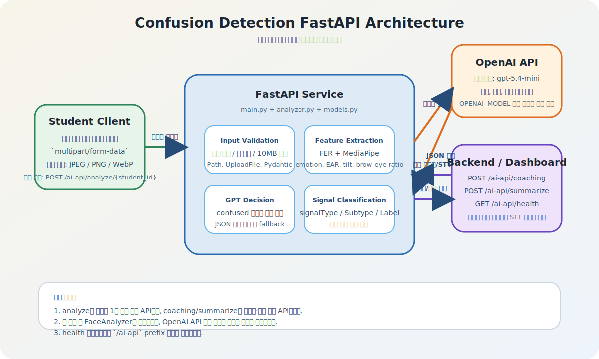
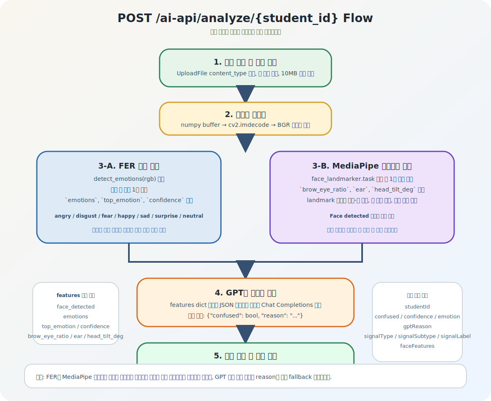
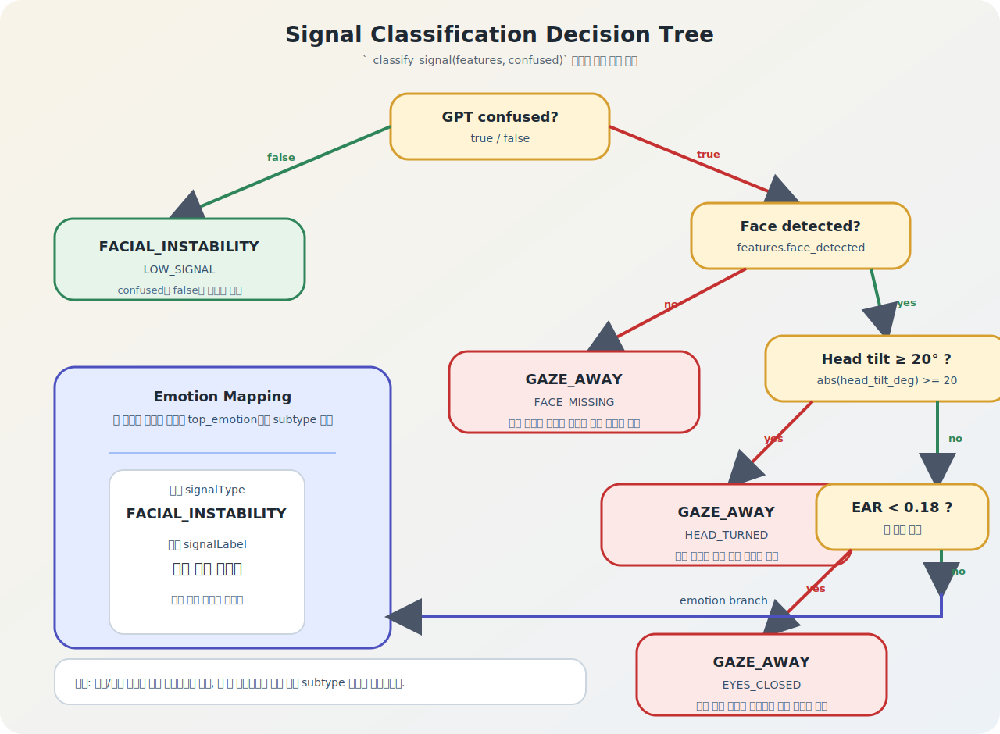
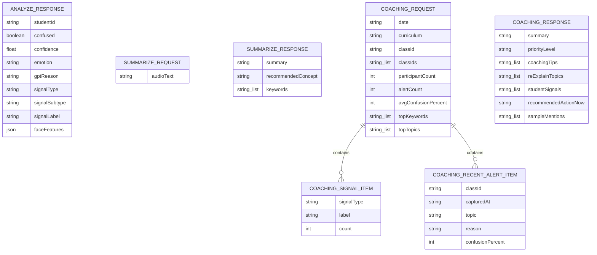
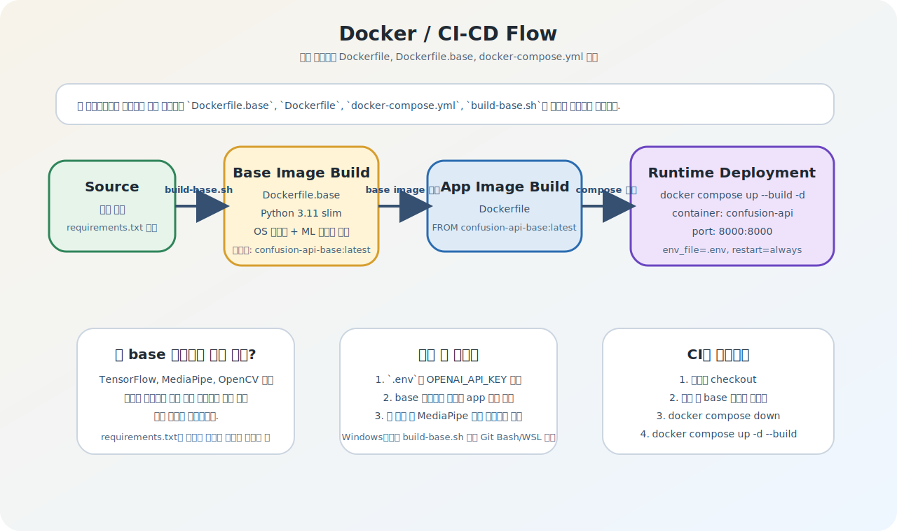

# Confusion Detection FastAPI

학생 얼굴 프레임과 수업 텍스트를 바탕으로 이해도 저하 신호를 분석하고, 강사용 코칭/요약 데이터를 생성하는 FastAPI 서비스입니다. 현재 구현의 중심은 `FER + MediaPipe + OpenAI` 조합이며, API 엔드포인트는 모두 [`main.py`](./main.py), 핵심 분석 로직은 [`analyzer.py`](./analyzer.py), 스키마는 [`models.py`](./models.py)에 모여 있습니다.

## 한눈에 보기

| 항목 | 내용 |
| --- | --- |
| 런타임 | Python 3.11 |
| 웹 프레임워크 | FastAPI 0.111.0 + Uvicorn 0.29.0 |
| 라우트 prefix | `/ai-api` |
| 주요 기능 | 얼굴 프레임 분석, 대시보드 코칭 생성, 수업 텍스트 요약, 헬스체크 |
| 얼굴 감정 분석 | `fer==22.5.1` |
| 얼굴 랜드마크 | `mediapipe==0.10.33` |
| GPT 연동 | OpenAI Chat Completions |
| 기본 모델 | `gpt-5.4-mini` (`OPENAI_MODEL`로 변경 가능) |
| 컨테이너 포트 | `8000` |

## 시스템 구조도



이 서비스는 독립적인 분석 API 역할을 수행합니다.

- 학생 클라이언트는 캡처 이미지 1장을 `POST /ai-api/analyze/{student_id}`로 전송합니다.
- FastAPI는 OpenCV로 이미지를 디코딩하고, FER와 MediaPipe에서 특징값을 추출합니다.
- 추출된 특징은 OpenAI 모델에 전달되어 `confused` 여부와 이유를 JSON으로 받습니다.
- 최종적으로 FastAPI가 신호 분류(`signal_type`, `signal_subtype`, `signal_label`)까지 붙여 응답합니다.
- 별도로 백엔드(Spring 등)는 대시보드 집계 데이터를 `POST /ai-api/coaching`, STT 텍스트를 `POST /ai-api/summarize`로 보내 강사용 결과를 생성할 수 있습니다.

## 분석 파이프라인



분석 흐름은 아래 순서로 진행됩니다.

1. 업로드 파일 검증
   - 허용 타입: `image/jpeg`, `image/png`, `image/webp`
   - 빈 파일 금지
   - 최대 크기: `10 MB`
2. 이미지 디코딩
   - `cv2.imdecode(..., cv2.IMREAD_COLOR)` 사용
3. 특징 추출
   - FER: 감정 분포, 최상위 감정, confidence
   - MediaPipe: `brow_eye_ratio`, `ear`, `head_tilt_deg`
4. GPT 판단
   - 특징값 전체를 JSON 문자열로 전달
   - 기대 응답 형식: `{"confused": bool, "reason": "..."}` 
5. 규칙 기반 신호 분류
   - GPT 결과와 특징값을 함께 사용
6. 최종 응답 생성
   - `AnalyzeResponse` 스키마로 직렬화

## 신호 분류 규칙



`analyzer.py`의 `_classify_signal(features, confused)`는 아래 규칙을 사용합니다.

### 1. GPT가 confused가 아니라고 판단한 경우

- `FACIAL_INSTABILITY / LOW_SIGNAL / 표정 기반 불안정`

### 2. GPT가 confused라고 판단한 경우

- 얼굴 미검출: `GAZE_AWAY / FACE_MISSING / 시선 이탈 / 화면 이탈`
- 고개 기울기 20도 이상: `GAZE_AWAY / HEAD_TURNED / 시선 이탈 / 화면 이탈`
- EAR < 0.18: `GAZE_AWAY / EYES_CLOSED / 시선 이탈 / 화면 이탈`
- 감정이 `fear`, `sad`, `surprise`, `angry`, `disgust` 중 하나면:
  - `FACIAL_INSTABILITY / {감정별 subtype} / 표정 기반 불안정`
- 그 외:
  - `FACIAL_INSTABILITY / CONFUSED_PATTERN / 표정 기반 불안정`

감정별 subtype 매핑은 다음과 같습니다.

| top_emotion | signal_subtype |
| --- | --- |
| `fear` | `FEAR_DOMINANT` |
| `sad` | `SAD_DOMINANT` |
| `surprise` | `SURPRISE_DOMINANT` |
| `angry` | `ANGRY_TENSION` |
| `disgust` | `DISGUST_TENSION` |
| 기타 | `CONFUSED_PATTERN` |

## API 개요

| Method | Path | 설명 |
| --- | --- | --- |
| `POST` | `/ai-api/analyze/{student_id}` | 학생 얼굴 프레임 분석 |
| `POST` | `/ai-api/coaching` | 대시보드 집계 데이터를 바탕으로 코칭 생성 |
| `POST` | `/ai-api/summarize` | 수업 텍스트 요약 |
| `GET` | `/ai-api/health` | 헬스체크 |

## API 상세

### 1. `POST /ai-api/analyze/{student_id}`

학생 프레임 이미지 1장을 받아 이해도 저하 신호를 분석합니다.

**Request**

- Path parameter: `student_id: str`
- Content-Type: `multipart/form-data`
- Form field: `file`

**Validation**

- 지원 확장 MIME: JPEG, PNG, WebP
- 파일 크기 0 byte면 `400`
- 파일이 10MB를 초과하면 `400`

**Response model**

- `studentId`
- `confused`
- `confidence`
- `emotion`
- `gptReason`
- `signalType`
- `signalSubtype`
- `signalLabel`
- `faceFeatures`

**예시 응답**

```json
{
  "studentId": "student-42",
  "confused": true,
  "confidence": 0.712,
  "emotion": "fear",
  "gptReason": "눈 주변 긴장과 불안정한 표정이 관찰되어 내용을 따라가기 어려운 상태로 보입니다.",
  "signalType": "FACIAL_INSTABILITY",
  "signalSubtype": "FEAR_DOMINANT",
  "signalLabel": "표정 기반 불안정",
  "faceFeatures": {
    "face_detected": true,
    "emotions": {
      "angry": 0.053,
      "disgust": 0.071,
      "fear": 0.712,
      "happy": 0.011,
      "sad": 0.084,
      "surprise": 0.049,
      "neutral": 0.02
    },
    "top_emotion": "fear",
    "confidence": 0.712,
    "brow_eye_ratio": 0.0382,
    "ear": 0.2113,
    "head_tilt_deg": 4.26
  }
}
```

**오류 응답**

```json
{
  "detail": "Unsupported content type: image/gif. Use JPEG, PNG, or WebP."
}
```

### 2. `POST /ai-api/coaching`

프론트 또는 백엔드에서 집계한 대시보드 데이터를 받아, 수업 중 즉시 활용 가능한 코칭 결과를 생성합니다.

**Request model**

- `date: str`
- `curriculum: str | None`
- `classId: str | None`
- `classIds: list[str]`
- `participantCount: int`
- `alertCount: int`
- `avgConfusionPercent: int`
- `topKeywords: list[str]`
- `topTopics: list[str]`
- `signalBreakdown: list[CoachingSignalItem]`
- `recentAlerts: list[CoachingRecentAlertItem]`

**예시 요청**

```json
{
  "date": "2026-04-13",
  "curriculum": "미적분",
  "classId": "class-101",
  "classIds": ["class-101"],
  "participantCount": 28,
  "alertCount": 6,
  "avgConfusionPercent": 37,
  "topKeywords": ["극한", "도함수", "접선"],
  "topTopics": ["도함수 정의", "평균변화율"],
  "signalBreakdown": [
    {
      "signalType": "FACIAL_INSTABILITY",
      "label": "표정 기반 불안정",
      "count": 4
    },
    {
      "signalType": "GAZE_AWAY",
      "label": "시선 이탈 / 화면 이탈",
      "count": 2
    }
  ],
  "recentAlerts": [
    {
      "classId": "class-101",
      "capturedAt": "2026-04-13T10:15:00+09:00",
      "topic": "도함수 정의",
      "reason": "학생 이해도 저하 추정",
      "confusionPercent": 43
    }
  ]
}
```

**Response model**

- `summary`
- `priorityLevel`
- `coachingTips`
- `reExplainTopics`
- `studentSignals`
- `recommendedActionNow`
- `sampleMentions`

**예시 응답**

```json
{
  "summary": "도함수 정의와 평균변화율 구간에서 학생 반응 저하가 반복되었습니다. 핵심 개념을 다시 연결해 설명하면 즉시 이해도를 끌어올릴 가능성이 있습니다.",
  "priorityLevel": "보통",
  "coachingTips": [
    "도함수 정의를 그래프 해석과 함께 다시 설명하세요.",
    "학생에게 평균변화율과 순간변화율 차이를 짧게 질문하세요."
  ],
  "reExplainTopics": ["도함수 정의", "평균변화율"],
  "studentSignals": ["표정 기반 불안정 증가", "시선 이탈 비율 상승"],
  "recommendedActionNow": "지금 바로 도함수 정의를 시각 예시와 함께 다시 정리해 주세요.",
  "sampleMentions": [
    "지금부터 도함수 정의를 그림으로 한 번 더 짚어볼게요.",
    "평균변화율과 순간변화율 차이를 같이 확인해볼게요."
  ]
}
```

참고로 GPT 응답 파싱에 실패하면 `_fallback_coaching()`이 동작해 입력 데이터 기반의 기본 메시지를 생성합니다.

### 3. `POST /ai-api/summarize`

수업 텍스트를 요약하고, 추가 설명이 필요해 보이는 개념과 핵심 키워드를 생성합니다.

**Request model**

- `audioText: str`

`audioText.strip()` 결과가 비어 있으면 `400`을 반환합니다.

**예시 요청**

```json
{
  "audioText": "도함수는 함수의 순간변화율을 나타냅니다. 평균변화율과 비교하면..."
}
```

**Response model**

- `summary`
- `recommendedConcept`
- `keywords`

**예시 응답**

```json
{
  "summary": "이번 설명은 도함수의 의미를 순간변화율 중심으로 정리했습니다. 평균변화율과의 차이를 이해하는 것이 다음 단계의 핵심입니다.",
  "recommendedConcept": "평균변화율과 순간변화율의 연결",
  "keywords": ["도함수", "순간변화율", "평균변화율"]
}
```

요약 응답은 `_normalize_two_sentences()`와 `_normalize_keywords()`를 통해 후처리됩니다.

### 4. `GET /ai-api/health`

서버 생존 여부와 `FaceAnalyzer` 초기화 상태를 확인합니다.

**예시 응답**

```json
{
  "status": "ok",
  "analyzer_ready": true
}
```

## 스키마 관계도 (ERD 스타일)

아래 ERD는 실제 DB 테이블이 아니라, API 요청/응답 객체 간 관계를 이해하기 위한 문서용 모델입니다.



## 코드 구조

```text
fastapi/
├── main.py
├── analyzer.py
├── models.py
├── requirements.txt
├── Dockerfile
├── Dockerfile.base
├── docker-compose.yml
├── build-base.sh
└── docs/
    ├── architecture.svg
    ├── analysis-flow.svg
    ├── signal-classification.svg
    └── cicd-flow.svg
```

파일별 역할은 다음과 같습니다.

### `main.py`

- FastAPI 앱 생성
- CORS 설정
- `lifespan`에서 `FaceAnalyzer` 1회 초기화
- API 라우팅과 입력 검증
- Pydantic 응답 모델 변환

### `analyzer.py`

- 이미지 디코딩
- FER 감정 분석
- MediaPipe 랜드마크 기반 수치 추출
- OpenAI를 통한 confusion 판단
- 요약/코칭 GPT 호출
- 신호 분류 및 fallback 처리

### `models.py`

- `AnalyzeResponse`
- `SummarizeRequest`, `SummarizeResponse`
- `CoachingRequest`, `CoachingResponse`
- 하위 스키마(`CoachingSignalItem`, `CoachingRecentAlertItem`)
- `ErrorResponse`

## 런타임 동작 상세

### 앱 시작 시

`main.py`의 `lifespan()`에서 전역 `analyzer`를 초기화합니다.

- `FaceAnalyzer()` 생성
- FER 인스턴스 준비
- MediaPipe 모델 파일 확인
- `face_landmarker.task`가 없으면 자동 다운로드
- OpenAI 클라이언트 생성

즉, 첫 요청 시 lazy-loading 하는 방식이 아니라 앱 시작 시 분석기를 준비하는 구조입니다.

### MediaPipe 모델 파일 저장 위치

운영체제에 따라 `face_landmarker.task` 저장 경로가 달라집니다.

- Windows: 사용자 홈 디렉터리 (`%USERPROFILE%\face_landmarker.task`)
- 그 외: `fastapi/face_landmarker.task`

이 동작은 `analyzer.py` 상단의 `MODEL_PATH` 분기에서 결정됩니다.

### 추출되는 특징값

`_extract_features()`가 반환하는 `features` 구조는 아래와 같습니다.

| 키 | 타입 | 설명 |
| --- | --- | --- |
| `face_detected` | `bool` | FER 또는 MediaPipe 중 하나라도 얼굴을 잡았는지 |
| `emotions` | `dict[str, float]` | FER 감정 분포 |
| `top_emotion` | `str` | FER 최상위 감정 |
| `confidence` | `float` | FER 최고 감정 점수 |
| `brow_eye_ratio` | `float \| None` | 눈썹-눈 간격 비율 |
| `ear` | `float \| None` | 눈 aspect ratio |
| `head_tilt_deg` | `float \| None` | 좌우 눈 위치 기반 머리 기울기 |

### 후처리 로직

- `_normalize_two_sentences()`
  - 요약 결과를 최대 2문장으로 정리
- `_normalize_keywords()`
  - 키워드 3개 이하, 각 키워드 최대 3단어
- `_normalize_priority()`
  - 허용값: `높음`, `보통`, `낮음`
- `_normalize_list()`
  - 중복 제거, 개수 제한

## 배포 및 실행

### 로컬 실행

```bash
cd fastapi
python -m venv .venv
. .venv/bin/activate
pip install -r requirements.txt
```

Windows PowerShell이라면 활성화 명령은 아래처럼 달라집니다.

```powershell
cd fastapi
python -m venv .venv
.venv\Scripts\Activate.ps1
pip install -r requirements.txt
```

환경 변수 설정:

```env
OPENAI_API_KEY=sk-...
OPENAI_MODEL=gpt-5.4-mini
```

실행:

```bash
uvicorn main:app --host 0.0.0.0 --port 8000 --reload
```

Swagger UI:

- `http://localhost:8000/docs`

ReDoc:

- `http://localhost:8000/redoc`

### Docker 실행

이 프로젝트는 무거운 의존성을 분리하기 위해 2단계 이미지 구조를 사용합니다.



### 1. base 이미지 생성

`Dockerfile.base`는 Python 3.11 slim 위에 시스템 패키지와 ML 의존성을 미리 설치합니다.

- 설치 OS 패키지
  - `libgl1`
  - `libglib2.0-0`
  - `libgomp1`
  - `libgles2`
  - `libegl1`
- `fer`는 `--no-deps`로 별도 설치
- 이후 `requirements.txt` 전체 설치

실행:

```bash
cd fastapi
bash ./build-base.sh
```

참고:

- `build-base.sh`는 bash 스크립트이므로 Windows에서는 Git Bash, WSL, 또는 동일한 내용을 수동으로 실행해야 합니다.
- `Dockerfile`은 `FROM confusion-api-base:latest`를 전제로 합니다.

### 2. 앱 이미지 빌드 및 실행

```bash
cd fastapi
docker compose up --build -d
docker compose logs -f
```

중지:

```bash
docker compose down
```

### `docker-compose.yml`

현재 compose 설정은 매우 단순합니다.

- 서비스명: `confusion-api`
- 컨테이너명: `confusion-api`
- 포트 매핑: `8000:8000`
- `.env` 파일 로드
- `restart: always`

## 코드상 주의사항

### 1. OpenAI API 키는 필수입니다

`FaceAnalyzer.__init__()`에서 `os.environ["OPENAI_API_KEY"]`를 직접 읽기 때문에 키가 없으면 앱 시작 자체가 실패합니다.

### 2. 일부 프롬프트 문자열 인코딩 확인이 필요합니다

현재 `analyzer.py`의 GPT 시스템 프롬프트 문자열 일부는 소스상에서 한글이 깨져 보입니다. README는 코드의 의도된 동작을 기준으로 정리했지만, 실제 운영 환경에서는 파일 인코딩이 UTF-8로 정상 저장되어 있는지 점검하는 것이 좋습니다.

### 3. `health`도 `/ai-api` 아래에 있습니다

라우터 prefix가 `/ai-api`이므로 헬스체크 경로는 `/health`가 아니라 `/ai-api/health`입니다.

### 4. 파일 업로드는 이미지 1장 기준입니다

동영상, 여러 장 이미지, 배치 분석은 아직 구현되어 있지 않습니다.

### 5. 얼굴 검출 실패 시 fallback이 존재합니다

이미지 디코딩 실패 또는 얼굴 검출 실패 시에도 완전히 예외를 내기보다, 기본값 기반의 fallback 응답이 반환될 수 있습니다.

## 개선 후보

- GPT 프롬프트 인코딩 정리
- 분석 기준값(`EAR < 0.18`, `head_tilt_deg >= 20`) 외부 설정화
- 응답 로깅에 request id 추가
- 테스트 코드 및 샘플 요청 컬렉션(Postman/Bruno) 추가
- `.env.example` 제공
- 배치 분석 또는 비디오 스트림 지원

## 문서 업데이트 기준

이 README는 2026-04-13 기준 저장소의 현재 코드 상태를 다시 읽고 작성했습니다. 문서와 코드가 달라질 수 있는 지점은 우선 아래 세 곳입니다.

- 라우트/입력 검증: `main.py`
- 분석/요약/코칭 로직: `analyzer.py`
- 스키마 정의: `models.py`
